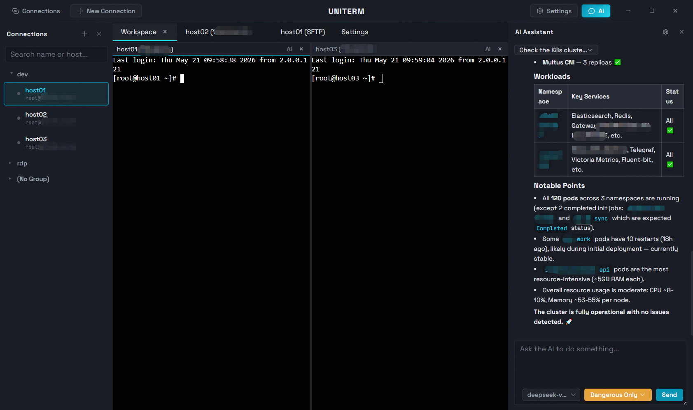
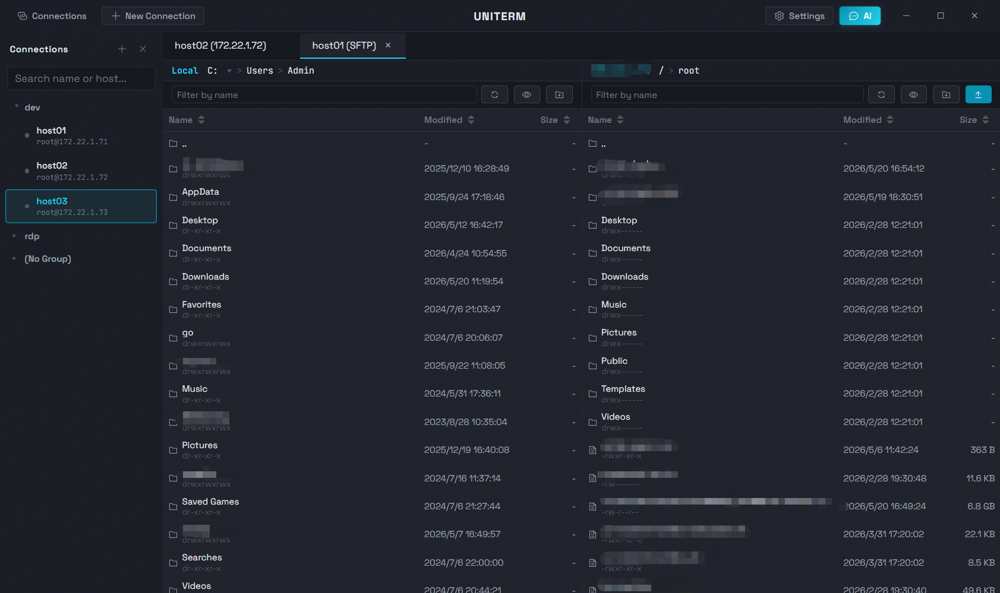
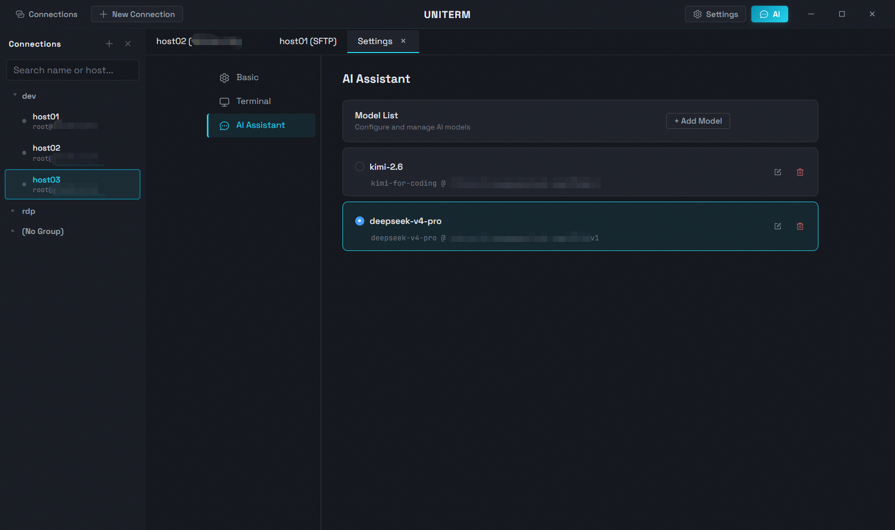

<div align="center">
  
  <h1>uniTerm</h1>
  <p>一款现代化跨平台终端模拟器，内置可自主执行的 AI Agent —— 能够像 Claude Code 一样独立规划并执行多轮 Shell 命令。</p>
  <p><a href="https://uniterm.net">🌐 软件首页</a> &nbsp;|&nbsp; <a href="https://github.com/ys-ll/uniterm">💻 GitHub</a></p>
</div>

[English](README.md)

[](https://github.com/ys-ll/uniterm/releases)
[](https://github.com/ys-ll/uniterm/releases/latest)
[](https://github.com/ys-ll/uniterm/releases)
[](https://github.com/ys-ll/uniterm/releases/latest)
[](https://github.com/ys-ll/uniterm)
[](LICENSE)
[](https://github.com/ys-ll/uniterm/commits)
[](https://github.com/ys-ll/uniterm)

## 目录

- [功能特性](#功能特性)
- [界面截图](#界面截图)
- [使用流程](#使用流程)
- [下载安装](#下载安装)
- [技术栈](#技术栈)
- [环境要求](#环境要求)
- [快速开始](#快速开始)
- [项目结构](#项目结构)
- [反馈与贡献](#反馈与贡献)
- [开源协议](#开源协议)

## 功能特性

### AI 助理

自主执行的 AI Agent，像 Claude Code 一样独立规划并执行多轮 Shell 命令，直接在终端中完成复杂任务。

- **自主多轮执行** — AI Agent 能够自主规划、执行、观察结果并迭代，在多轮 Shell 命令中无需人工干预即可完成复杂操作。
- **大模型集成** — 侧边栏对话，兼容 Anthropic / OpenAI 协议，支持 Claude、GPT 及其他兼容模型。
- **灵活的执行模式** — 提供免确认、仅高危确认、写操作确认、全部确认四种模式，自主权由你掌控。
- **对话持久化** — 会话聊天记录按标签页保存，重新打开应用后历史记录仍然保留。
- **终端智能协作** — AI 命令直接在当前终端标签页中执行，支持固定到指定标签页或跟随当前激活终端。分屏中人与 AI 各司其职，同屏协作互不干扰。
- **智能补全** — SSH 终端输入时，根据历史命令和 AI 能力实时提供命令补全建议。

### 全功能终端

本地终端、SSH / Telnet / Mosh、SFTP / FTP、服务器监控、RDP / VNC / SPICE、数据库 —— 覆盖所有远程访问场景。

- **远程终端** — 支持 SSH / Telnet / Mosh。支持密码或私钥认证连接远程服务器，其中 SSH、Telnet、Mosh 分别适用于常规远程、老旧/嵌入式设备、高延迟移动网络场景。
- **本地终端** — 支持 PowerShell / CMD / Git Bash / WSL。与 SSH 会话共享字体、配色和操作设置。
- **串口终端** — 扫描可用串口并配置波特率、数据位、停止位、校验位后连接，支持本地回显和 CR→CRLF 换行规范化。
- **文件传输** — 支持 SFTP / FTP / FTPS / Zmodem。双栏并排浏览本地与远程文件。SFTP 基于 SSH，FTP/FTPS 支持显式 TLS、被动/主动模式、字符编码可配置。支持上传、下载、拖拽、删除、重命名等操作，传输任务按标签页独立跟踪，可暂停、继续或取消。SFTP 支持最大并发传输数限制。SSH 终端内支持 Zmodem 协议（`rz`/`sz`），拖拽文件即可上传。
- **远程桌面** — 支持 RDP / VNC / SPICE。可连接 Windows 远程桌面、VNC 和 SPICE。
- **数据库客户端** — 连接 MySQL / PostgreSQL / rqlite 数据库，支持 SQL 查询执行、表结构浏览、数据行在线编辑，统一界面管理全部数据源。
- **SSH 隧道** — 端口转发。任何连接可选择已有 SSH 连接作为跳板，自动分配本地端口通过隧道访问目标，支持所有 TCP 协议连接类型。
- **服务器监控** — 实时监看已连接服务器的运行状态。支持性能指标（CPU、内存、磁盘、网络）、进程列表及详情、监听端口、磁盘用量与挂载信息、网卡列表及 bond/bridge 识别。

| 类别 | 协议 | 说明 |
|------|------|------|
| 终端 | SSH | 远程服务器命令行管理 |
| 终端 | Telnet | 老旧设备、嵌入式系统的远程终端 |
| 终端 | Mosh | 高延迟、断续网络下的服务器连接 |
| 终端 | Serial | 串口终端连接，支持波特率等参数配置 |
| 终端 | Local | PowerShell、CMD、Git Bash 等本地 Shell |
| 终端 | WSL | 通过本地终端打开已安装的 WSL 发行版 |
| 文件传输 | SFTP | 服务器文件管理与传输 |
| 文件传输 | FTP / FTPS | 网站空间、NAS 文件传输 |
| 文件传输 | Zmodem | SSH 终端内 rz/sz 命令传输文件 |
| 远程桌面 | RDP | Windows 服务器远程桌面管理（仅 Windows） |
| 远程桌面 | VNC | Linux 服务器远程控制 |
| 远程桌面 | SPICE | KVM/QEMU 虚拟机管理 |
| 数据库 | MySQL | 兼容 MySQL 协议：MySQL、MariaDB、TiDB 等 |
| 数据库 | PostgreSQL | 兼容 PostgreSQL 协议：PostgreSQL、CockroachDB 等 |
| 数据库 | rqlite | 基于 SQLite、Raft 共识的轻量分布式数据库 |
| 监控 | Monitor | 基于 SSH 的服务器 CPU、内存、磁盘实时监控 |

### 自定义能力

连接管理、工作区分屏、云端同步、主题定制 —— 你的终端由你掌控。

- **连接管理器** — 保存、搜索、编辑、分组、复制服务器连接，支持拖拽排序，可多选或范围选择进行批量连接、批量删除等操作。
- **工作区与自由分屏** — 将多个终端标签页合并为工作区，支持水平或垂直分屏布局，拖拽面板边缘或标题栏即可自由调整大小和位置。
- **云端同步** — 基于 GitHub、GitLab、Gitee 私有仓库构建专属私人云同步仓库，所有配置（连接信息、AI 模型密钥、应用设置）经 AES-256-GCM 加密后保存至远端。支持自动同步、冲突解决、主密码修改和仓库绑定管理。
- **主题** — 暗色、深蓝、浅色三种界面主题，支持跟随系统自动切换。
- **国际化** — 支持简中、繁中、英、日、韩、德、西、法、俄等 9 种语言界面。
- **跨平台** — 基于 Wails v2 构建，原生运行于 Windows、macOS、Linux 三大桌面平台。

## 界面截图

<p align="center">
  
  
</p>
<p align="center">
  
</p>

## 使用流程

### SSH 连接

1. 在连接管理器中点击**新建连接**
2. 填入主机、端口和认证信息（密码或私钥）
3. 点击**连接**打开 SSH 终端会话

### AI 助理

1. 进入设置页面，配置你的 **AI 大模型**（API 地址、模型和密钥）
2. 打开一个终端标签页（SSH 或本地）
3. 打开 AI 侧边栏对话，输入需求 —— AI Agent 直接在终端中执行命令

### SFTP 文件传输

1. 在连接管理器中**右键**一个 SSH 连接
2. 选择**连接 SFTP**
3. 在双栏文件管理器中浏览、上传、下载或拖拽文件

## 下载安装

前往 [GitHub Releases](https://github.com/ys-ll/uniterm/releases) 下载最新版本：

- **Windows**: 下载 `uniterm-windows-amd64-installer-*.exe` 安装包
- **macOS**: 下载 `uniterm-darwin-universal-*.dmg`
- **Linux**: 下载 `uniterm-linux-amd64-*.tar.gz`

## 技术栈

| 层级 | 技术 |
|------|------|
| 桌面框架 | Wails v2 |
| 后端 | Go |
| 前端 | Vue 3 + Pinia + Element Plus |
| 终端引擎 | xterm.js |
| AI 协议 | Anthropic Messages API / OpenAI Chat Completions API |

## 环境要求

- [Go](https://go.dev/dl/) 1.23+
- [Node.js](https://nodejs.org/) 20+
- [Wails CLI](https://wails.io/docs/gettingstarted/installation) v2

### 平台依赖

- **Windows**: WebView2 运行时（Windows 10+ 已内置）
- **macOS**: Xcode Command Line Tools
- **Linux**: `libgtk-3-dev` 和 `libwebkit2gtk-4.1-dev`

## 快速开始

```bash
git clone https://github.com/ys-ll/uniterm.git
cd uniTerm
cd frontend && npm install && cd ..
wails dev                   # 开发模式运行
wails build                 # 构建生产版本
```

## 项目结构

```
uniTerm/
├── main.go                       # 入口文件
├── app.go                        # Wails 绑定、LLM API 代理、SFTP API
├── backend/
│   ├── session/                  # SSH/SFTP/数据库 会话管理
│   ├── database/                 # SQL 执行、表结构查询、DSN 构建
│   ├── store/                    # 持久化配置（连接、AI、设置）
│   └── log/                      # 文件日志
├── frontend/
│   └── src/
│       ├── components/           # Vue 组件
│       ├── composables/          # 终端组合式函数
│       ├── stores/               # Pinia 状态管理
│       ├── services/             # AI 代理循环、LLM 客户端
│       ├── i18n/                 # 国际化翻译
│       └── types/                # TypeScript 类型定义
└── wails.json
```

## 反馈与贡献

欢迎通过 [GitHub Issues](https://github.com/ys-ll/uniterm/issues) 提交问题、建议或使用反馈。

## Star 趋势

<a href="https://star-history.com/#ys-ll/uniterm&Date">
  <picture>
    <source media="(prefers-color-scheme: dark)" srcset="https://api.star-history.com/svg?repos=ys-ll/uniterm&type=Date&theme=dark" />
    <source media="(prefers-color-scheme: light)" srcset="https://api.star-history.com/svg?repos=ys-ll/uniterm&type=Date" />
    
  </picture>
</a>

## 开源协议

Apache 2.0
